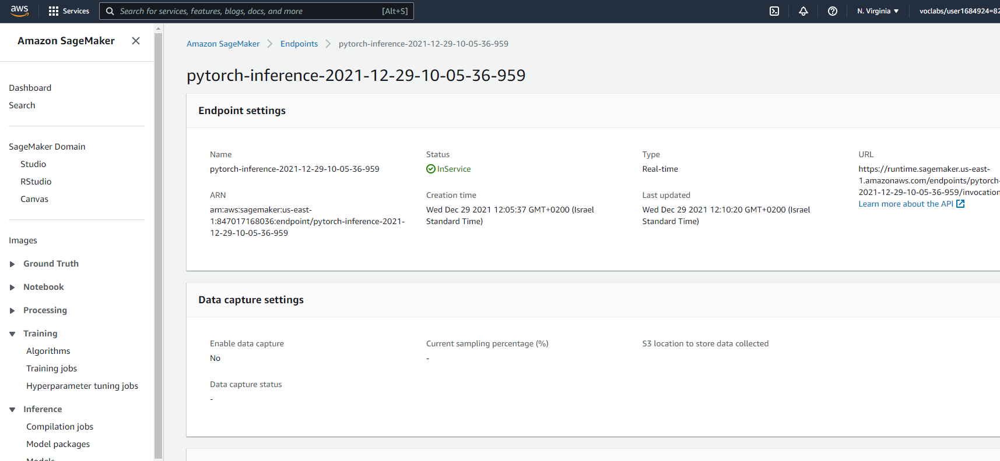

# Image Classification using AWS SageMaker

Use AWS Sagemaker to train a pretrained model that can perform image classification by using the Sagemaker profiling, debugger, hyperparameter tuning and other good ML engineering practices. This can be done on either the provided dog breed classification data set or one of your choice.

## Project Set Up and Installation
Enter AWS through the gateway in the course and open SageMaker Studio. 
Download the starter files.
Download/Make the dataset available. 

## Dataset
The provided dataset is the dogbreed classification dataset which can be found in the classroom.
The project is designed to be dataset independent so if there is a dataset that is more interesting or relevant to your work, you are welcome to use it to complete the project.

### Access
Upload the data to an S3 bucket through the AWS Gateway so that SageMaker has access to the data. 

## Hyperparameter Tuning
The pretrained model of choice for this project is Resnet18. Resnet is one of the best-performing pretrained datasets used for image recognition. 

For the hyperparameter tuning, I included the following hyperparameters and ranges:

1. learning rate (lr) with a range of .001 - .1
2. batch size with options 16, 32, 64, 128
3. epochs with a range of 2 to 5

These hyperparameters were chosen because they have the greatest effect on a model's performance.

Hyperparameter tuning jobs successfully completed

Log metrics from hyperparameter tuning job

Best parameters

## Debugging and Profiling
Next, I performed model debugging and profiling. I created rules for the profiler, such as loss_not_decreasing and overfit. I then set the profiler and debugger configuration settings and trained the model, making sure to embed the debug/profilng hooks within the training code.

### Results
The model performed well overall. There were some recommendations such as increaasing the batch size or minimizing blocking calls.

## Model Deployment
The model is deployed to an aws endpoint and is queried using the predict function with the payload (as a series of bytes) and the content type (Image/jpeg) as parameters. The response is a list of 133 numbers representing the 133 dog breed classes. The highest number represents the highest probability that the image is of that class. For example, in our notebook, the 50th number is the highest, hence it predicts that the picture is of a dog from the breed of the 50th class (a Chinese shar-pei). 

Incidentally, the image is actually of a Chow-chow, but it looks similar to the Chinese shar-pei.

The active endpoint

